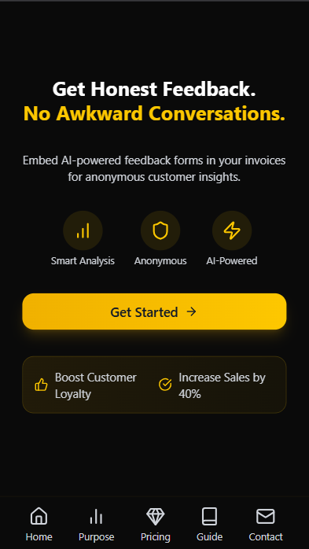

# InvisiFeed: The SaaS That Turns Invoices Into Growth Machines!

**Live App:** [invisifeed.vercel.app](https://invisifeed.vercel.app)
**Status:** ✅ Fully Functional | 🔐 Main Codebase is Private | 📄 This Repo is for Documentation Only

---

## 📌 Overview

**InvisiFeed** is a modern, full-stack SaaS platform built specifically for **freelancers, agencies, consultants, contractors, and service-based businesses** who want to:

* Generate and send professional invoices
* Collect honest, **anonymous** feedback from their clients
* Analyze performance and improve service quality with the help of AI
* Automate and simplify the invoice-to-feedback lifecycle

It transforms traditional invoices into **Smart Invoices** by embedding feedback forms and reward coupons directly inside downloadable PDF invoices.

---

## ❗ Note about this Repository

> ⚠️ This repository is strictly for **documentation purposes only**.

* The **actual project source code is hosted in a private repository** to protect the intellectual property and prevent unauthorized replication.
* If you are an interested recruiter, potential collaborator, or reviewer, please contact the maintainer for access or demo requests.

---

## 🚀 Key Features

### 🔄 Smart Invoice System

* Upload your own invoice PDF, or use the built-in invoice creator.
* Optionally add a **discount coupon** to reward customers who provide feedback.
* System generates a combined "Smart Invoice" PDF:

  * Original Invoice Page
  * Feedback Page with:

    * Link to feedback form
    * QR Code for mobile access
* Share directly with your client via the app.

### 🖋️ Feedback Form

* Includes:

  * Customer Satisfaction Rating
  * Communication Rating
  * Quality of Service Rating
  * Value for Money Rating
  * Recommendation Rating
  * Overall Rating
  * Feedback content (manual or AI-generated)
  * Suggestions (manual or AI-generated)
* Clients can:

  * Submit **anonymously** (no trace, no data saved)
  * Submit **non-anonymously** without extra fields (auto-filled securely)

### 🧐 AI-Enhanced Feedback Insights

* After submission, coupons are revealed.
* AI engine (Gemini 2.0 Flash API) analyzes feedback and:

  * Identifies Top 3 Areas of Improvement
  * Identifies Top 3 Areas of Strength

### 📊 Business Analytics Dashboard

* Stats & Visualizations:

  * Total Sales (Stat Card)
  * Total Feedback to Total Invoice Ratio (Pie Chart)
  * Average Feedback Response Time
  * Positive vs Negative Feedback (Pie Chart)
  * Service Metrics: Average ratings for each of the 6 rating fields
  * Sales Trend over Time (Bar Chart)
  * Overall Rating Over Time (Line Chart)
  * AI Highlights:

    * Best Performing Areas
    * Worst Performing Areas
* Feedback History Section
* Reset All Data Option

### 📆 Invoice & Coupon Management

* **Create Invoice Page:**

  * Fill business details
  * Add GSTIN if available
  * Option to include feedback and coupons
* **Upload Invoice Page:**

  * Upload any PDF
  * Add optional coupon
* **Coupon Management Page:**

  * View all coupons
  * Search and filter
  * Delete manually
  * Expired coupons auto-deleted (via CRON)

### 🎓 Sample Testing Mode

* Test out features without uploading real data
* Use pre-filled invoice samples for a simulated experience

### 📅 Subscription & Pricing

* **Free Plan:**

    * Unlimited feedback collection
    * Basic analytics dashboard
    * Standard feedback form
    * Create upto 3 Invoices daily
    * Feedback filters and sorting
    * Email support
* **Pro Plan:**
    * Everything in Free plan
    * Sales growth tracking
    * Rating trend analysis
    * Convert traditional invoices to smart invoices
    * Generate upto 10 invoices daily
    * Add coupons to invoices
* **7-Day Trial:**

  * Available for Pro Plan
  * CRON-Job automatically downgrades after expiry
* **Payments:** Razorpay Domestic + International integration

### 🛠️ Account Management

* **Manage Profile** page:

  * Update user info
  * Delete account permanently
* Reset feature: Clears all uploaded invoice and feedback data
* Temporary file storage: Cloudinary files auto-deleted
* Forgot Password / Reset Password

---

## 🤝 Why InvisiFeed?

**Problem:** Most freelancers and service providers send invoices but never get real feedback. If they do, it’s usually vague, biased, or lacks honesty.

**InvisiFeed Solves This:**

* Combines invoicing + reward-based feedback
* Maintains anonymity
* Uses AI to make sense of feedback
* Helps improve client satisfaction and service quality

> Backed by research. Built for real users. Designed to help you grow.

See our [Purpose Page](https://invisifeed.vercel.app/purpose) for survey data and rationale.

---

## 📅 Pages & Components

* **Landing Page** — Modern, clean SaaS homepage with pricing & CTA
* **Purpose Page** — Problem, solution, and research-backed reasoning
* **Guide Page** — Beginner tutorial explaining all use-cases and steps
* **FAQs** — Commonly asked questions and troubleshooting
* **Review & Feedback Section** — Submit testimonials, issues, or ideas
* **Privacy Policy / Terms of Service** — Full legal documentation

---

## 📱 Fully Responsive — Works Beautifully on All Devices

Seamless design across mobile, tablet, and desktop.
Built with a mobile-first approach to ensure top-tier usability, speed, and accessibility on every screen size.

  
  &nbsp;&nbsp;&nbsp;
  

---

## 🚧 Tech Stack

### 🔹 Frontend

* **Next.js (App Router)**
* **JavaScript**
* **TailwindCSS** + **Shadcn UI** + **Radix UI**
* **Framer Motion** for animations
* **Recharts** for analytics charts
* **React-Hook-Form** for robust form management

### 🔸 Backend / APIs

* **NextAuth** for authentication
* **Cloudinary** for file storage
* **pdf-lib** + **react-pdf** for invoice + feedback PDF generation
* **QRCode** for smart form linking
* **Zod** for validation
* **JWT, Bcrypt** for secure auth
* **Nodemailer** for transactional emails
* **Mongoose** for MongoDB
* **Gemini 2.0 Flash API** for AI feedback analysis
* **Razorpay** for domestic/international payments
* **ClearTax GSTIN API** for business validation
* **CRON Jobs** for auto-downgrade, cleanup

### 🔹 Database

* **MongoDB Atlas** (Cloud-based NoSQL)

---

## 📊 Project Metrics

* ✔️ **Fully Functional SaaS Platform**
* 📊 **35+ Backend APIs**
* 🎨 **50+ Frontend Components**
* ⚙️ **20+ Utility Functions**
* 📅 **5 Database Models**
* 🚀 **800+ Commits**
* ⏰ **Built in 50 Days**
* 👥 **Team: 2 Developers**

---

## 📧 Contact & Access

Want a demo, walkthrough, or request access to the private repo?

**Connect with:**

#### **Shubh Verma**
* Email: [shubhverma2003@gmail.com](mailto:shubhverma2003@gmail.com)
* Twitter: [@ShubhOnX](https://x.com/ShubhOnX)
* LinkedIn: [@shubh-v21](https://linkedin.com/in/shubh-v21)

#### **Sneha Sharma**
* Email: [snehav2109@gmail.com](mailto:snehav2109@gmail.com)
* Twitter: [@SnehaDevs](https://x.com/SnehaDevs)
* LinkedIn: [@ss0807](https://linkedin.com/in/ss0807)

---

## 🏃️ Final Words

InvisiFeed is a next-gen product that fuses invoicing, client satisfaction, and anonymous insights into one seamless, intelligent platform.

> Built to serve those who serve others.

If you're a freelancer or service provider wanting to grow, earn repeat business, and refine your reputation, **InvisiFeed is your companion**.

---

**⭐ Star this repo if you love the mission and idea. Your support helps!**
